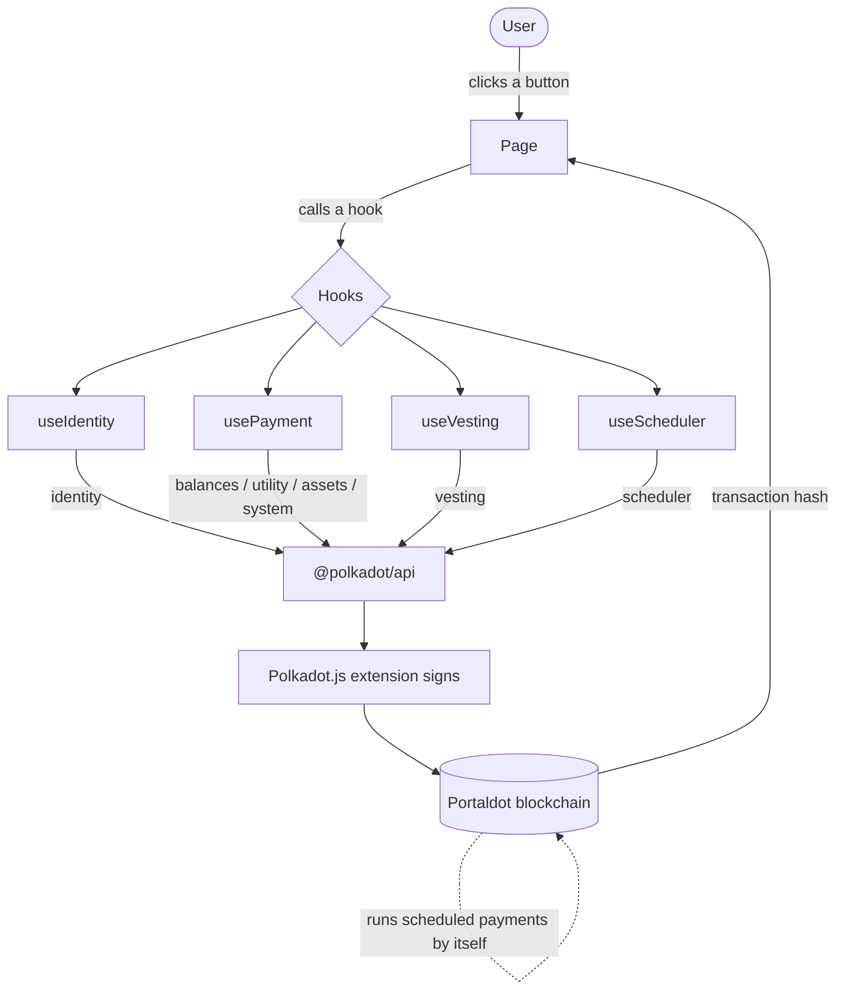

<div align="center">
  
</div>

<div align="center">
  <strong>Built on Portaldot &nbsp;|&nbsp; Native pallets only &nbsp;|&nbsp; Zero smart contracts</strong>
</div>

<br>

PortalPay is a simple money app for the Portaldot blockchain. Instead of sending
funds to a long, error-prone wallet address, you send them to a human name such
as `bob.portalpay`. On top of plain payments, it can also lock funds, run payroll
on a schedule, and release an inheritance automatically — all without any smart
contracts and without any background servers, because the Portaldot blockchain
performs those actions itself.

---

## Table of contents

1. The problem
2. The solution
3. The novelty
4. Features (with examples)
5. Tech stack
6. Architecture
7. Project structure
8. Getting started
9. Documentation references
10. License

---

## 1. The problem

A blockchain wallet address looks like this:

```
5GrwvaEF5zXb26Fz9rcQpDWS57CtERHpNehXCPcNoHGKutQY
```

It is 48 characters long. Nobody can remember it, and nobody types it correctly.
A single wrong character sends the money to the wrong place, and on a blockchain
that mistake is permanent — the funds cannot be recovered.

This is the main reason everyday people find crypto payments frightening.

There is a second, deeper problem. Useful money features — paying a salary every
month, or passing funds to a family member if something happens to you — normally
require two extra things on most blockchains:

- a custom program uploaded to the chain (a "smart contract"), and
- a separate computer running around the clock to trigger that program on time.

That is expensive, fragile, and something always has to be maintained.

---

## 2. The solution

PortalPay solves both problems.

For the first problem, it turns a wallet address into a readable name. You claim
your name once. After that, anyone can pay you by typing `bob.portalpay` — no
address to copy, no mistakes to make.

For the second problem, PortalPay uses abilities that are built directly into the
Portaldot blockchain. Portaldot can lock funds over time and can run scheduled
tasks on its own. PortalPay puts those abilities behind simple buttons, so
recurring payroll and automatic inheritance work with no smart contract and no
server. The blockchain itself does the work.

In plain terms: claim a name, share it, get paid. And if you want, let the chain
handle the rest automatically.

---

## 3. The novelty

Paying by name is not new on its own; several projects on other blockchains do
it. The genuinely new part of PortalPay is *how it automates payments*.

On most blockchains, automatic payments (recurring salaries, "release my funds if
I disappear") need a smart contract plus an external service that presses the
button at the right time. PortalPay needs neither. Portaldot has a built-in
scheduler, so the chain executes the payment by itself, and a built-in lock
mechanism, so funds can be released gradually.

The result is a payments app where the most powerful features have:

- no smart contract to deploy or audit,
- no off-chain server or bot to run or trust,
- nothing extra that can fail or be attacked.

This is practical on Portaldot and is not practical on a typical smart-contract
chain without that extra machinery. That difference is the core of the product.

---

## 4. Features (with examples)

Every feature below uses a native Portaldot capability. None of them use a smart
contract.

### 4.1 Pay by name
Send POT to a person using their name instead of their address.

- How to use: open `Pay`, choose `Send to one`, type `bob`, enter `5`, click `Send POT`.
- Behind the scenes: the name is resolved to an address, then the funds are sent.

### 4.2 Split pay
Pay several people at once, in a single all-or-nothing transaction.

- How to use: open `Pay`, choose `Split pay`, add `bob` for `3` and `carol` for `2`, click `Send to 2 people`.
- Result: both transfers happen together, or neither does.

### 4.3 Pay with a note
Attach a memo (such as an invoice number) that is recorded on the blockchain.

- How to use: open `Pay`, choose `With memo`, type `bob`, `5`, and a note like `Invoice 1024`, then send.
- Result: the payment and the note are recorded together as a permanent receipt.

### 4.4 Pay any token
Send tokens other than POT to a name.

- How to use: open `Pay`, choose `Pay a token`, type the asset id (for example `1`).
  The app reads the token's name and decimals from the chain automatically. Enter
  the recipient and amount, then send.

### 4.5 Locked payment
Send funds that the recipient can see immediately but can only spend gradually as
time passes. Useful for paying on delivery or in milestones.

- How to use: open `Locked`, choose `Locked payment`, type `bob`, `50`, and the
  number of blocks to unlock over, then click `Lock payment`.
- Result: the recipient claims the unlocked portion over time.

### 4.6 Recurring payment
Schedule a payment that the chain sends again and again on its own.

- How to use: open `Locked`, choose `Recurring payment`, type `bob`, `10`,
  repeat every `100` blocks, `10` times, then schedule it.
- Result: the chain sends the payment automatically. No server is involved.

### 4.7 Payroll
Pay an entire team on a schedule, in one automatic batch.

- How to use: open `Payroll`, add each team member and amount, set how often and
  how many times, then schedule it.
- Result: every pay run is one combined transaction that the chain fires by itself.

### 4.8 Inheritance (dead-man's switch)
Name someone to receive your funds if you ever stop responding.

- How to use: open `Heir`, type your heir's name, the amount, and an inactivity
  window in blocks, then set it. Tap `I'm here` any time to reset the timer.
- Result: if you do not check in before the window ends, the chain sends the
  funds to your heir automatically. Cancel any time.

### 4.9 Public profile and shareable pay link
Every claimed name has a public page showing the display name, balance, and a
verified mark if applicable.

- How to use: visit `/profile/bob.portalpay`. Anyone can open it, with or without
  a wallet, to pay that person.

### 4.10 Claim your name
Register your own name so others can pay you.

- How to use: open `Claim`, type the name you want, and confirm. Your display name
  is saved on the chain, and the name becomes yours.

---

## 5. Tech stack

| Layer | Tool | Purpose |
|---|---|---|
| Blockchain | Portaldot (Substrate based) | The network that holds names, balances, and runs scheduled tasks |
| Token | POT (14 decimals) | The currency used for payments and fees |
| Wallet | Polkadot.js browser extension | Approves transactions; the app never sees your private key |
| Chain connection | `@polkadot/api` | Talks to the Portaldot node over a WebSocket |
| Signing | `@polkadot/extension-dapp` | Connects the wallet to the app |
| Frontend | React, Vite, React Router | The web interface |
| Command line | Python with `substrate-interface` | Scripts for testing without the web app |

No smart contract language is used anywhere. All on-chain behavior comes from
Portaldot's built-in modules.

---

## 6. Architecture

The app is organized in clear layers. A payment flows through them in a straight
line, from the button you click down to the blockchain and back.



The diagram source is also available as a standalone file at `architecture.mmd`.

Layer by layer:

- Pages (`src/pages`) are the screens: Home, Pay, Profile, Claim, LockedPay,
  Payroll, Heir.
- Hooks (`src/hooks`) hold the logic for each on-chain capability:
  - `useChain` opens the connection to the node.
  - `useWallet` connects the browser extension and provides the signer.
  - `useIdentity` resolves names and reads or sets identities.
  - `usePayment` handles instant pay, split pay, pay with memo, and token pay.
  - `useVesting` handles locked payments and claiming unlocked funds.
  - `useScheduler` handles all scheduled actions (recurring, payroll, inheritance).
    This is the single place that talks to the scheduler, so there is one code
    path, not several.
- Library (`src/lib`) holds shared values and helpers: `chain.js` (network
  settings and number conversions) and `logger.js` (readable console output).

---

## 7. Project structure

```
portalpay/
  scripts/
    chain.py             chain connection helper
    logger.py            colored terminal logs
    setup_identity.py    register identity and claim a name
    send_payment.py      send POT by name (command line)
    split_pay.py         batch payment to several names
    seed_demo.py         set up demo names (alice, bob, charlie)
    locked_pay.py        send a locked payment
    vest.py              claim unlocked funds
    schedule_payment.py  schedule a recurring payment
    requirements.txt
  frontend/
    src/
      App.jsx            root component and routing
      main.jsx
      lib/
        chain.js         network settings and conversions
        logger.js        readable console logs
      hooks/
        useChain.js      chain connection
        useWallet.js     wallet connection and signing
        useIdentity.js   names and identities
        usePayment.js    pay, split, memo, token
        useVesting.js    locked payments
        useScheduler.js  recurring, payroll, inheritance
      components/
        NavBar.jsx
        VestingStatus.jsx
        TransactionFeed.jsx
      pages/
        Home.jsx
        Pay.jsx
        Profile.jsx
        Claim.jsx
        LockedPay.jsx
        Payroll.jsx
        Heir.jsx
    index.html
    package.json
    vite.config.js
  README.md
```

---

## 8. Getting started

Follow these steps in order.

### Step 1 - Run a local Portaldot node

Download and start the development node from the official guide:
https://portaldot-dev.readthedocs.io/en/latest/getting-started/local_test.html

```
./portaldot_dev --dev --alice
```

Leave it running. It provides test accounts (Alice, Bob, Charlie) with free POT.

### Step 2 - Seed demo data (optional, recommended)

```
cd scripts
pip install -r requirements.txt
python seed_demo.py
```

This registers names for the demo accounts so you have someone to pay.

### Step 3 - Run the web app

```
cd frontend
npm install
npm run dev
```

Open http://localhost:5173

### Step 4 - Install the wallet

Install the Polkadot.js extension from https://polkadot.js.org/extension/ and
import a development account. Then click `Connect wallet` in the app.

### Step 5 - Switching to the live network

The active network is set in `frontend/src/lib/chain.js`. For the live network,
point `ACTIVE_WS` at the mainnet address:

```
wss://mainnet.portaldot.io
```

Network values, from the official documentation:

```
local websocket  : ws://127.0.0.1:9944
mainnet websocket: wss://mainnet.portaldot.io
address format   : 42
token            : POT
decimals         : 14
```

---

## 9. Documentation references

All on-chain behavior is based on the official Portaldot documentation:
https://portaldot-dev.readthedocs.io/en/latest/

| Capability | Module and call | Used for |
|---|---|---|
| Resolve a name to an address | `identity.usernameInfoOf` | Every payment |
| Read an identity | `identity.identityOf` | Profiles, verified mark |
| Set a display name | `identity.setIdentity` | Claiming a name |
| Accept a name | `identity.acceptUsername` | Claiming a name |
| Send POT | `balances.transferKeepAlive` | Pay by name |
| Batch several calls | `utility.batchAll` | Split pay, payroll |
| Send any token | `assets.transferKeepAlive` | Token pay |
| Read token details | `assets.metadata` | Token name and decimals |
| Lock funds over time | `vesting.vestedTransfer` | Locked payment |
| Claim unlocked funds | `vesting.vest` | Locked payment |
| Schedule a future or repeating action | `scheduler.scheduleNamedAfter` | Recurring, payroll, inheritance |
| Cancel a scheduled action | `scheduler.cancelNamed` | Reset or cancel inheritance |
| Record a note on chain | `system.remarkWithEvent` | Pay with a note |

---

## 10. License

MIT. You own what you build.

---

<div align="center">
  Human-readable payments on Portaldot. The blockchain does the work itself.
</div>

<div align="center">
  
</div>
