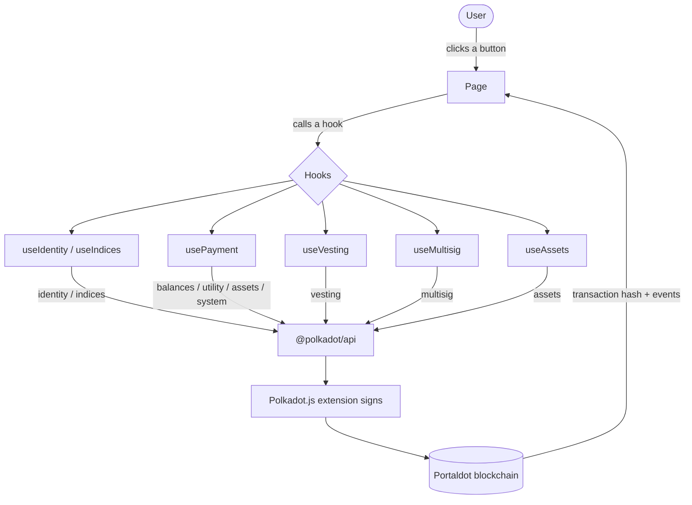

<div align="center">
  
</div>

<div align="center">
  <strong>Built on Portaldot &nbsp;|&nbsp; Native pallets only &nbsp;|&nbsp; Zero smart contracts</strong>
</div>

<br>

PortalPay is a simple money app for the Portaldot blockchain. Instead of sending
funds to a long, error-prone wallet address, you claim a short **handle** like
`#42` and share that. On top of plain payments it can also lock funds over time,
run a shared team treasury that needs multiple approvals, and let anyone mint
their own token — all using capabilities built directly into Portaldot, with **no
smart contracts**.

---

## Table of contents

1. The problem
2. The solution
3. The novelty
4. Features
5. Tech stack
6. Architecture
7. Project structure
8. Getting started
9. Documentation references
10. License

---

## 1. The problem

A blockchain wallet address looks like this:

```
5GrwvaEF5zXb26Fz9rcQpDWS57CtERHpNehXCPcNoHGKutQY
```

It is 48 characters long. Nobody can remember it, and nobody types it correctly.
A single wrong character sends the money to the wrong place, and on a blockchain
that mistake is permanent. This is the main reason everyday people find crypto
payments frightening.

Beyond addresses, useful money features — paying in milestones, running a shared
team fund, or issuing a community token — usually require a custom smart contract
uploaded to the chain. That is extra code to write, audit, and maintain.

---

## 2. The solution

PortalPay solves both problems.

For the address problem, it turns your account into a short, memorable **handle**.
You claim a number such as `#42` once; after that, anyone can pay you by typing
`#42` — no address to copy, no mistakes to make.

For the features problem, PortalPay uses abilities that are **built into**
Portaldot's runtime. Locking funds over time, requiring multiple approvals to
spend from a shared account, and minting a new token are all native pallet
operations. PortalPay puts them behind simple buttons — no smart contract to
deploy, audit, or maintain.

---

## 3. The novelty

The novelty of PortalPay is that **every feature is a native Portaldot pallet —
there is not a single smart contract anywhere.**

Portaldot is built with Substrate and Rust and is deliberately **not**
EVM-compatible. On an EVM chain, each capability below is a separate contract you
must write, audit, deploy, and maintain. On Portaldot the same capability already
exists in the runtime, so you only pay a normal transaction fee to use it.

| Capability | On an EVM chain | On Portaldot (PortalPay) |
|---|---|---|
| Name / handle | Deploy a registry contract | `indices.claim` — built in |
| Locked payment | Write + deploy an escrow/vesting contract | `vesting.vestedTransfer` — built in |
| Shared wallet | Deploy a multisig (e.g. Safe) contract | `multisig.asMulti` — built in |
| Token | Deploy an ERC-20 contract | `assets.create` — built in |
| Atomic split | Deploy a multicall contract | `utility.batchAll` — built in |

**What that means for cost and risk:**

| | EVM contract approach | PortalPay (native) |
|---|---|---|
| Up-front engineering | Write Solidity for each feature | None — the pallets already exist |
| Security audit | Recommended per contract (typically thousands of USD) | None — pallets are part of the audited runtime |
| Deployment cost | One-time gas to deploy each contract | **Zero** — there is nothing to deploy |
| Cost to use | Gas per call | A normal transaction fee per extrinsic |
| Ongoing risk | Contract bugs, upgrades, exploits | No app-specific contract to exploit |

PortalPay is a thin, honest UI over those native primitives: it builds the exact
extrinsic, the user signs it in their wallet, and the chain enforces the rules.
Nothing is custodial, nothing is a contract, and there is no off-chain server in
the money path. That is the point — a complete payments product built **natively**
on Portaldot, embracing its architecture instead of re-implementing EVM patterns.

---

## 4. Features

Every feature below maps to a native Portaldot pallet. None use a smart contract.

### 4.1 Claim a handle
Claim a short number like `#42` that maps to your address, plus an optional
display name. Share `#42` instead of a 48-character address.
- **Example:** open `Claim`, type `42`, optionally add the name `Bob Smith`, click `Claim #42`. You now own `#42`.
- **Pallets:** `indices.claim` (+ `identity.setIdentity`).

### 4.2 Pay by handle
Send POT to someone by typing their handle (`#42`) or their address. The handle
is resolved to an address, then the funds are sent.
- **Example:** open `Pay` → `Send to one`, type `#42`, enter `5`, click `Send POT`.
- **Pallets:** `indices.accounts` lookup + `balances.transferKeepAlive`.

### 4.3 Split pay
Pay several people at once in a single all-or-nothing transaction — either every
transfer happens, or none do.
- **Example:** open `Pay` → `Split pay`, add `#42` for `3` and `#7` for `2`, click `Send to 2 people`. Both land in one block, or neither does.
- **Pallets:** `utility.batchAll`.

### 4.4 Pay with a note
Attach a memo (such as an invoice number) recorded permanently on chain alongside
the payment.
- **Example:** open `Pay` → `With memo`, type `#42`, `5`, and a note like `Invoice 1024`, then send. The transfer and the note land together as a permanent receipt.
- **Pallets:** `utility.batchAll([balances.transferKeepAlive, system.remarkWithEvent])`.

### 4.5 Pay any token
Send tokens other than POT. The app reads the token's name and decimals from the
chain automatically.
- **Example:** open `Pay` → `Pay a token`, enter asset id `1`, recipient `#42`, amount `5`, then send.
- **Pallets:** `assets.transferKeepAlive`.

### 4.6 Launch your own token
Mint your own currency — community points, a creator coin, event credits — and
issue the initial supply to yourself in one signature.
- **Example:** open `Token`, set name `Coffee Token`, symbol `COFFEE`, supply `1000`, click `Create token`. It then appears in `Pay → Pay a token`.
- **Pallets:** `utility.batchAll([assets.create, assets.setMetadata, assets.mint])`.

### 4.7 Locked payment
Send funds the recipient can see immediately but can only spend gradually as
blocks pass — ideal for milestone or on-delivery payments. Minimum 100 POT
(the chain's vesting minimum).
- **Example:** open `Locked`, type `#42`, `200`, unlock over `100` blocks, click `Lock payment`. The recipient sees 200 POT but can only spend it as it unlocks.
- **Pallets:** `vesting.vestedTransfer` / `vesting.vest`.

### 4.8 Shared wallet (team treasury)
Create an M-of-N shared account: spending requires a threshold of signatories to
each approve the same payment, enforced natively by the chain.
- **Example:** open `Shared`, keep the pre-filled Alice / Bob / Charlie at threshold `2 of 3`, fund it `20` POT, propose `5` POT to `#42`; switch to Bob in the extension and approve — on the 2nd approval the chain sends it.
- **Pallets:** `multisig.asMulti`.

### 4.9 Public profile and pay link
Every handle and address has a public page showing the display name and balance.
- **Example:** visit `/profile/42`. Anyone can open it, with or without a wallet, to look up and pay that person.
- **Pallets:** `indices.accounts`, `identity.identityOf`, `system.account` (read-only).

---

## 5. Tech stack

| Layer | Tool | Purpose |
|---|---|---|
| Blockchain | Portaldot (Substrate based) | Holds handles, balances, tokens, vesting and multisig state |
| Token | POT (14 decimals) | The currency used for payments and fees |
| Wallet | Polkadot.js browser extension | Approves transactions; the app never sees your private key |
| Chain connection | `@polkadot/api` | Talks to the Portaldot node over a WebSocket |
| Address tools | `@polkadot/util-crypto` | SS58 validation and multisig address derivation |
| Signing | `@polkadot/extension-dapp` | Connects the wallet to the app |
| Frontend | React, Vite, React Router | The web interface |

No smart contract language is used anywhere. All on-chain behavior comes from
Portaldot's built-in pallets.

---

## 6. Architecture

A payment flows in a straight line from the button you click down to the chain
and back.



The diagram source is also at `architecture.mmd`.

Layer by layer:

- **Pages** (`src/pages`) are the screens: Pay, Locked, Multisig (Shared), Token,
  Profile, Claim, Home.
- **Hooks** (`src/hooks`) hold the logic for each on-chain capability:
  - `useChain` — opens the connection to the node.
  - `useWallet` — connects the browser extension and provides the signer.
  - `useIdentity` — resolves a handle / address / display name and sets identity.
  - `useIndices` — claims and resolves short `#handles`.
  - `usePayment` — instant pay, split pay, pay with memo, token pay.
  - `useVesting` — locked payments and claiming unlocked funds.
  - `useMultisig` — M-of-N shared-wallet payments.
  - `useAssets` — create and read tokens.
  - `useFeed` — live transaction feed from chain events.
- **Library** (`src/lib`) holds shared values and helpers: `chain.js` (network
  settings and number conversions) and `logger.js` (readable console output).

---

## 7. Project structure

```
portalpay/
  frontend/
    src/
      App.jsx            root component and routing
      main.jsx
      lib/
        chain.js         network settings and conversions
        logger.js        readable console logs
      hooks/
        useChain.js      chain connection
        useWallet.js     wallet connection and signing
        useIdentity.js   handle/address resolution and identity
        useIndices.js    short #handle claim and lookup
        usePayment.js    pay, split, memo, token transfer
        useVesting.js    locked payments
        useMultisig.js   shared-wallet (M-of-N) payments
        useAssets.js     create and read tokens
        useFeed.js       live event feed
      components/
        NavBar.jsx
        VestingStatus.jsx
        TransactionFeed.jsx
      pages/
        Home.jsx
        Pay.jsx          pay / split / memo / token
        Locked.jsx       (LockedPay.jsx) vesting
        Multisig.jsx     shared wallet
        Token.jsx        launch a token
        Profile.jsx      look up a handle or address
        Claim.jsx        claim your #handle
    index.html
    package.json
    vite.config.js
  architecture.mmd
  README.md
  RUNNING-ON-WINDOWS.md  Windows/WSL setup walkthrough
```

---

## 8. Getting started

### Step 1 — Run a local Portaldot node

Download and start the development node from the official guide:
https://portaldot-dev.readthedocs.io/en/latest/getting-started/local_test.html

```
portaldot_dev --dev --alice
```

Leave it running. It provides pre-funded test accounts (Alice, Bob, Charlie).

> **On Windows:** the node ships as a Linux/macOS binary, so run it inside WSL2.
> A full step-by-step (download, run, wallet import, dev-account gotchas) is in
> [`RUNNING-ON-WINDOWS.md`](RUNNING-ON-WINDOWS.md).

### Step 2 — Run the web app

```
cd frontend
npm install
npm run dev
```

Open the printed URL (usually http://localhost:5173).

### Step 3 — Install the wallet

Install the Polkadot.js extension from https://polkadot.js.org/extension/ and
import a development account (see `RUNNING-ON-WINDOWS.md` for the exact dev-account
seed — `//Alice` alone is not a valid mnemonic). Then click **Connect wallet**.

### Step 4 — Try it

1. **Claim** a handle, e.g. `#42`.
2. **Pay** → type `#42` (or an address) and send.
3. **Token** → launch a token, then send it from **Pay → Pay a token**.
4. **Locked** → lock ≥100 POT to a recipient that unlocks over blocks.
5. **Shared** → create a 2-of-3 wallet, fund it, propose and co-approve a payment.

### Switching to the live network

The active network is set in `frontend/src/lib/chain.js`. For mainnet, point
`ACTIVE_WS` at `wss://mainnet.portaldot.io`.

```
local websocket  : ws://127.0.0.1:9944
mainnet websocket: wss://mainnet.portaldot.io
address format   : 42
token            : POT
decimals         : 14
```

---

## 9. Documentation references

All on-chain behavior is based on the official Portaldot documentation:
https://portaldot-dev.readthedocs.io/en/latest/

| Capability | Module and call | Used for |
|---|---|---|
| Claim a short handle | `indices.claim` | Claim |
| Resolve a handle → address | `indices.accounts` | Every payment by handle |
| Set a display name | `identity.setIdentity` | Claim, profiles |
| Read an identity / balance | `identity.identityOf`, `system.account` | Profiles |
| Send POT | `balances.transferKeepAlive` | Pay |
| Batch several calls atomically | `utility.batchAll` | Split pay, memo, token launch |
| Record a note on chain | `system.remarkWithEvent` | Pay with a note |
| Create / mint a token | `assets.create`, `setMetadata`, `mint` | Launch a token |
| Send any token | `assets.transferKeepAlive` | Pay a token |
| Lock funds over time | `vesting.vestedTransfer` | Locked payment |
| Claim unlocked funds | `vesting.vest` | Locked payment |
| Shared M-of-N spending | `multisig.asMulti` | Shared wallet |

---

## 10. License

MIT. You own what you build.

---

<div align="center">
  Human-readable payments on Portaldot. Native pallets, no contracts.
</div>

<div align="center">
  
</div>
